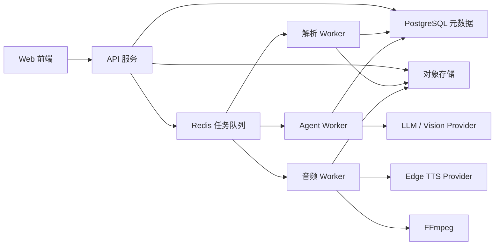

# AI 阅读与有声化 Agent 平台规格

> 当前基线：第一阶段已于 2026-08-15 完成。当前解析器版本为 `phase1-v3`，原文朗读脚本版本为 `original-v2`。第二阶段的领域分析索引、Agent 工具调用和讲解版生成仍属于后续范围。

## 1. 文档目的

本文档定义一个以内容理解为核心、以原文朗读和讲解音频为输出的个人阅读平台。

项目不是单纯的文本转语音工具。系统需要同时支持：

- 保存和管理个人文章、书籍和相关资源。
- 对小说进行章节规划和叙事结构解析。
- 对技术书籍和文章解析代码、图片、流程图、用例图、表格和公式。
- 通过 Agent 根据用户的自然语言目标生成不同的讲解版本。
- 保持原文朗读能力，并支持将讲解稿转为音频。
- 将长任务拆成可观察、可暂停、可恢复、可局部重试的后台任务。

本文档是后续数据模型、API、Worker 和前端任务界面的共同基线。

## 2. 产品定位

产品定位：面向个人知识资料的 AI 阅读、理解和有声化工作台。

核心资产不是最终 MP3，而是以下可追溯链路：

```text
原始资料
  -> 结构化文档
  -> 领域分析与证据索引
  -> 原文版或讲解版
  -> 音频版本
```

同一份结构化文档可以生成多个版本，例如：

- 小说原文朗读版。
- 小说人物专线。
- 小说精讲版。
- 一小时读完版。
- 技术书原文朗读版。
- 技术概念专题讲解版。
- 架构图和代码联合讲解版。

## 3. 设计原则

### 3.1 事实层与表达层分离

原文、章节、图片、代码和引用属于事实层；朗读稿、精讲稿、人物专线和技术专题属于表达层。

表达层内容必须能够回溯到事实层的内容块。

### 3.2 Agent 决定计划，程序保证执行

Agent 可以根据用户目标动态生成分析计划，但不能直接负责文件写入、状态变更或音频拼接。

所有长任务必须落成持久化任务节点，具备状态、依赖、重试次数和产物记录。

### 3.3 稳定解析优先于自由生成

编码检测、章节切分、代码语言识别、音频分片和 FFmpeg 调用优先使用确定性程序。

大模型主要处理语义理解、视觉解释、内容重组和自然语言生成。

### 3.4 增量处理和局部恢复

一本书中已经成功的章节、内容分析和音频片段，不应因为另一个章节失败而重新生成。

### 3.5 先模块化单体，再考虑拆分服务

初期使用独立 API 进程、Worker 进程、数据库和对象存储，但代码保持模块化，不立即引入微服务网络复杂度。

## 4. 系统架构



### 4.1 Web 前端

负责：

- 资料库浏览和搜索。
- 文件导入和解析预览。
- 原文阅读和章节导航。
- Agent 对话与任务计划展示。
- 讲解稿查看和编辑。
- 音频任务进度、章节播放和失败重试。

前端不得直接访问数据库、对象存储、LLM、TTS 或 FFmpeg。

### 4.2 API 服务

负责：

- 用户请求校验。
- 创建资料、分析、Agent 运行和音频任务。
- 查询任务状态和产物。
- 提供文档、证据、脚本和音频访问接口。
- 发布后台任务到 Redis。

API 请求不能同步执行整本书解析、模型调用或音频合成。

### 4.3 Worker

Worker 分为逻辑模块，不要求第一版拆成独立部署单元：

- Ingestion Worker：导入、解码和基础清洗。
- Parsing Worker：结构化文档和领域索引。
- Agent Worker：动态分析计划和讲解稿生成。
- Audio Worker：TTS 分片、校验和 FFmpeg 拼接。

### 4.4 存储

- PostgreSQL：实体、状态、依赖、配置和索引元数据。
- 对象存储：原始文件、图片、代码附件、脚本快照和音频。
- Redis：任务队列、短期锁和 Worker 调度信息。

开发阶段允许使用本地文件系统实现对象存储接口，但生产代码不能把文件路径逻辑散落到业务层。

## 5. 内容输入范围

### 5.1 第一阶段

- TXT：小说和纯文本资料。
- Markdown：技术文章和代码块。
- HTML：带图片、代码和表格的技术文章。
- 粘贴文本。

### 5.2 后续阶段

- EPUB：电子书章节和插图。
- PDF：技术书和扫描资料。
- 网页 URL：抓取并保存原始快照。
- ZIP 或离线网页包。

不同来源必须通过 Source Adapter（来源适配器）转换为统一的结构化文档输入。

## 6. 文档领域模型

### 6.1 LibraryItem

表示资料库中的一本书或一篇文章。

字段：

- `id`
- `title`
- `author`
- `content_type`: `novel`、`technical`、`article`、`unknown`
- `status`
- `cover_asset_id`
- `created_at`
- `updated_at`

### 6.2 SourceDocument

表示用户导入的一份原始资料或资料版本。

字段：

- `id`
- `library_item_id`
- `source_type`
- `original_filename`
- `mime_type`
- `content_hash`
- `asset_id`
- `encoding`
- `parse_status`
- `created_at`

原始字节必须保留，不允许只保存清洗后的文本。

### 6.3 ParsedDocument

表示某个来源版本解析出的统一文档。

字段：

- `id`
- `source_document_id`
- `parser_version`
- `document_type`
- `language`
- `status`
- `report_asset_id`

### 6.4 ContentBlock

统一内容块类型：

```text
document
volume
chapter
section
heading
paragraph
dialogue
list
table
code
image
diagram
formula
quote
note
unknown
```

每个块至少保存：

- `id`
- `parsed_document_id`
- `parent_id`
- `position`
- `block_type`
- `text`
- `asset_id`
- `source_start`
- `source_end`
- `metadata`
- `parser_version`

`source_start` 和 `source_end` 用于保留原文位置，`metadata` 用于存储语言、图片类型、章节编号等领域无关属性。

## 7. 领域化解析

领域化解析不是一次总结调用，而是“通用结构化 + 专业索引生成”。

### 7.1 通用解析

顺序：

```text
保存原始字节
  -> 检测编码
  -> 规范化换行和空白
  -> 提取文档节点
  -> 分配稳定 block_id
  -> 建立父子关系和原文位置
```

基础处理包括：

- UTF-8、GBK、Big5 等编码检测。
- BOM、换行、不可见字符和空行处理。
- 广告和水印候选行标记。
- 标题和章节候选识别。
- 图片、表格、代码和公式资源抽取。

语义广告删除、章节纠错和异常结构修复必须保留原始版本和变更报告。

### 7.2 小说解析器

第二阶段完整形态输出 `NovelAnalysis`：

- 卷、章、节树。
- 人物实体和别名。
- 人物出现位置。
- 人物关系和关系变化。
- 事件、参与者、地点和时间。
- 事件因果关系。
- 主线、支线和伏笔候选。
- 章节重要性评分。
- 对话和旁白比例。
- 需要特殊发音的专名。

模型生成的每个实体、事件和结论必须包含：

- `source_block_ids`
- `quote`
- `confidence`
- `analysis_version`

小说原文朗读只依赖章节规划和朗读清洗，不强制等待完整人物关系分析。

第一阶段已落地的确定性卷章规则：

- 支持无空行章节标题和阿拉伯数字、中文数字章节编号。
- 支持“集、卷、部、篇”等卷级标题。
- 支持复合标题，例如将 `第一集 斗罗世界 第1章 斗罗大陆，异界唐三` 拆为卷 `第一集 斗罗世界` 和章 `第1章 斗罗大陆，异界唐三`。
- 同一卷名连续出现时只创建一个 `volume`，后续 `chapter` 通过 `parent_id` 挂到该卷。
- `引子`、`序章`、`楔子`、`序言` 和 `前言` 可以作为复合标题中的章级节点。
- 书名和章节前的前置正文并入首个可朗读章节，不额外创建“第 1 部分”。
- 每个新卷的首个朗读 Part 使用“卷名 · 章名”作为复合标题；后续章节保持章名，避免重复朗读卷名。

### 7.3 技术内容解析器

第二阶段完整形态输出 `TechnicalAnalysis`：

- 概念、定义和术语。
- 概念依赖关系。
- 结论、前提和限制条件。
- 代码语言和语法结构。
- 函数、类、接口和调用关系。
- 图片和图表类型。
- 流程图节点、边、分支和循环。
- 用例图参与者、用例和关系。
- 架构图组件、边界和数据流。
- 表格字段和比较维度。
- 公式和符号。

代码应优先经过语法解析器，再由模型结合上下文解释；除非用户明确允许，不自动执行不可信代码。

图片处理顺序：

```text
抽取图片
  -> OCR
  -> 视觉分类
  -> 结构化识别
  -> 结合前后文解释
  -> 保存 source_block_ids
```

## 8. Agent 运行模型

本节定义第二阶段目标。第一阶段仅预留 `AgentRun`、`Evidence` 和 Edition 关联模型，不代表以下工具和动态计划已经实现。

### 8.1 Agent 输入

- 用户问题或目标。
- 资料范围。
- 领域和语言偏好。
- 读者水平。
- 目标时长。
- 剧透限制。
- 输出形式。
- 是否需要音频。

### 8.2 Agent 输出

Agent 首先输出结构化计划：

```json
{
  "goal": "解释某个人物的完整故事",
  "steps": [
    { "type": "search_entity", "target": "人物" },
    { "type": "collect_events", "target": "人物" },
    { "type": "build_timeline" },
    { "type": "generate_outline" },
    { "type": "write_narration" }
  ],
  "constraints": {
    "duration_minutes": 20,
    "spoiler": "full"
  }
}
```

计划通过后，系统将步骤编译为可执行 TaskGraph（任务图）。

### 8.3 Agent 工具

第二阶段首批工具集合：

- `search_blocks`
- `read_blocks`
- `get_chapter`
- `find_entity_mentions`
- `trace_events`
- `compare_sections`
- `inspect_image`
- `inspect_code`
- `get_concept_dependencies`
- `estimate_duration`
- `build_outline`
- `write_edition`
- `create_audio_render`

工具必须限制可访问的资料范围，并返回原文引用，不允许 Agent 任意读取服务器文件。

### 8.4 事实核验

讲解稿生成后进行核验：

- 每个关键结论是否有引用。
- 是否引用了错误章节。
- 是否把模型推断写成原文事实。
- 是否超出用户要求的范围。
- 目标时长和字数是否满足约束。

核验失败时，Agent 需要修改讲稿或标记不确定性，而不是直接发布。

## 9. Edition 与脚本

`Edition` 表示同一份资料的一个表达版本。

版本类型包括：

- `original_reading`
- `enhanced_reading`
- `deep_explanation`
- `short_summary`
- `character_story`
- `topic_explanation`
- `custom`

每个 Edition 保存：

- `id`
- `library_item_id`
- `parsed_document_id`
- `agent_run_id`
- `edition_type`
- `title`
- `full_text`
- `script_version`
- `source_references`
- `status`

脚本块需要保存：

- `id`
- `position`
- `kind`
- `text`
- `source_block_ids`
- `section_title`
- `audio_status`

原文和 AI 补充内容必须在数据层可区分，前端也应支持显示来源。

## 10. 音频流水线

### 10.1 任务结构

```text
AudioRender
  -> AudioPart
      -> AudioChunk
```

- `AudioPart`：章节或讲解段，用户可播放的最小完整单位。
- `AudioChunk`：TTS 内部切片，不直接作为用户播放单位。

### 10.2 流程

```text
脚本版本确认
  -> 按章节或段落切 Part
  -> 每个 Part 切 Chunk
  -> 持久化全部 Part、Chunk 和批次位置
  -> 只投递当前批次
  -> 批内并发调用 Edge TTS
  -> 校验音频产物
  -> 按顺序交给 FFmpeg
  -> 写入 Part 音频和时长
  -> 当前批全部到达终态后领取下一批
  -> 清理临时 Chunk 文件
```

### 10.3 分批调度

整本书禁止在创建 `AudioRender` 时一次性投递全部章节。第一阶段采用固定章数批次：

```text
第 1 批：第 1-3 章
  -> 最多同时处理 2 章
  -> 任一章成功后立即可播放
  -> 三章均成功或最终失败后放行第 2 批
第 2 批：第 4-6 章
  -> 按相同规则继续
```

持久化字段：

- `AudioRender.batch_size`：每批 Part 数，默认 3。
- `AudioRender.batch_count`：当前 Render 的总批次数。
- `AudioRender.next_batch_index`：下一个待领取批次的索引。
- `AudioPart.batch_index`：当前 Part 所属批次。

调度不变量：

- 创建 Render 后只发布 `batch_index = 0` 的任务。
- `retryable` 不是终态；自动重试耗尽前不能放行下一批。
- `succeeded` 和最终 `failed` 是批次终态；某章最终失败不阻塞后续批次。
- 使用 PostgreSQL 行锁领取下一批，多个 Part 同时结束时只能有一个 Worker 推进 `next_batch_index`。
- 已取消的 Render 或 Part 不能被延迟到达的 Celery 消息重新启动。
- 下一批消息投递失败后的完全恢复需要事务 Outbox 或定期协调任务，列为后续可靠性增强项。

### 10.4 并发限制

必须独立配置：

- 全局 AudioRender 并发。
- 单个 Render 内 Part 并发。
- 单个 Part 内 TTS Chunk 并发。
- FFmpeg 拼接并发。

推荐第一版默认值：

```text
audio_batch_size = 3
job_concurrency = 2
tts_chunk_concurrency = 2
global_tts_concurrency = 3
assemble_concurrency = 1
```

开发和部署时解析 Worker 与音频 Worker 必须分开。音频 Worker 使用 2 个执行进程，避免大量已领取任务在 Redis 并发槽外等待并制造无意义重试。

### 10.5 重试

可重试：

- 超时。
- 网络断开。
- 429。
- 5xx。
- 临时 WebSocket 错误。

不可重试：

- 空文本。
- 无效音色。
- 参数格式错误。
- 本地文件权限错误。
- 缺失 FFmpeg 输入。

Chunk 失败只影响当前 Part；Part 失败不阻塞同一 Render 的其他 Part。

第一阶段音频 Part 对临时错误总计尝试 3 次。前两次失败标记为 `retryable`，第三次仍失败才标记为最终 `failed` 并允许批次继续。手动重试只重置选中的 Part 和对应任务节点，已成功章节不重新生成。

### 10.6 缓存键

音频缓存键至少包含：

```text
hash(script_block_text)
voice
rate
pitch
provider
provider_version
```

脚本内容、音色或参数变化时，不得错误复用旧音频。

## 11. 任务状态与可观察性

### 11.1 通用任务状态

```text
pending
running
succeeded
failed
retryable
paused
canceled
```

### 11.2 任务记录

每个任务节点保存：

- `id`
- `run_id`
- `parent_id`
- `node_type`
- `status`
- `progress`
- `attempt_count`
- `max_attempts`
- `input_hash`
- `output_asset_id`
- `error_code`
- `error_message`
- `started_at`
- `heartbeat_at`
- `finished_at`

### 11.3 前端展示

前端至少展示：

- 当前运行阶段。
- 总体进度。
- 已完成和失败的章节。
- 当前执行节点。
- 最近错误。
- 重试次数。
- 可播放产物数量。
- 预计剩余任务数量。
- 当前批次、总批次数和每批章节数。
- 当前批次可播放章节，以及尚未投递的后续章节数量。

进度不能只用一个整本书百分比，必须能展开到章节、Part 和 Chunk。

长书页面默认只渲染已处理 Part 和当前批次 Part，远期未投递章节用数量摘要表示，避免用户为了找到可播放音频下滑完整本书。

## 12. API 范围

### 12.1 第一阶段已实现

```text
GET    /healthz
GET    /readyz
POST   /library/items
GET    /library/items
GET    /library/items/{item_id}
GET    /library/items/{item_id}/editions
POST   /documents/{source_id}/parse
GET    /documents/{document_id}
GET    /documents/{document_id}/blocks
GET    /documents/{document_id}/chapters
GET    /sources/{source_id}/documents
GET    /editions/{edition_id}
POST   /editions/{edition_id}/audio
GET    /editions/{edition_id}/audio-renders
GET    /audio-renders/{render_id}
POST   /audio-parts/{part_id}/retry
GET    /audio-parts/{part_id}/stream
GET    /jobs/{run_id}
```

所有创建型长任务接口快速返回运行 ID，第一阶段前端使用轮询读取 PostgreSQL 中的持久化状态。音频流支持 HTTP Range、206 部分响应和非法范围 416。

### 12.2 后续规划

#### 资料库

```text
DELETE /library/items/{id}
POST   /library/items/{id}/sources
```

#### Agent

```text
POST /agent/runs
GET  /agent/runs/{id}
POST /agent/runs/{id}/approve
POST /agent/runs/{id}/cancel
GET  /agent/runs/{id}/evidence
```

#### Edition

```text
POST /editions/{id}/revise
GET  /editions/{id}/references
```

#### 音频

```text
POST /audio-renders/{id}/retry
POST /audio-renders/{id}/cancel
POST /audio-renders/{id}/pause
POST /audio-renders/{id}/resume
```

后续创建型接口继续返回任务 ID；实时状态优先从轮询演进到 SSE，不因进度展示单独引入 WebSocket。

## 13. 非功能要求

- 所有外部模型调用必须记录 provider、模型、耗时和错误类型。
- 所有 AI 结果必须保存版本，不能覆盖历史分析。
- 任务重启后可以根据数据库状态恢复。
- 重复提交相同输入时应通过内容哈希避免重复解析。
- 原始资料和中间产物不能进入 Git。
- 生产路径使用 WSL/Linux 兼容的 FFmpeg，不依赖 Windows `.exe`。
- 日志中不得记录完整 API Key。
- 用户删除资料时，数据库记录和对象存储产物都必须清理。

## 14. 第一阶段范围

第一阶段目标是建立可靠事实层和原文朗读闭环：

1. 资料库和原始文件保存。
2. TXT、Markdown、HTML 导入。
3. 通用 ContentBlock 模型。
4. 小说章节解析。
5. 技术内容代码、图片和图表块识别。
6. 原文朗读版生成。
7. Edge TTS 并发、缓存和重试。
8. FFmpeg 章节拼接。
9. 章节级任务进度和局部重试。
10. 原文块和音频片段之间的引用关系。

第一阶段暂不做完整 Agent 对话，但数据模型必须为 AgentRun、Evidence 和 Edition 预留接口。

### 14.1 完成状态

截至 2026-08-15，上述 10 项均已形成可运行闭环：

| 能力       | 当前结果                                                              |
| ---------- | --------------------------------------------------------------------- |
| 资料导入   | TXT、Markdown、HTML 和粘贴文本可导入，上传成功后前端有明确反馈        |
| 编码与清洗 | 保留原始字节，支持编码检测、清洗文本复用、广告候选标记和原文位置      |
| 小说结构   | 支持普通标题、无空行标题和复合卷章标题                                |
| 技术结构   | 识别标题、段落、代码、图片/图表、表格和列表，并保留元数据             |
| Edition    | 创建版本化原文朗读稿，按章节分组并保留 `source_block_ids`             |
| 音频       | Edge TTS、Mock 测试 Provider、Chunk 缓存、FFmpeg 拼接和时长探测       |
| 调度       | 固定 3 章一批、批内 2 Part 并发、数据库行锁放行下一批                 |
| 恢复       | 临时错误自动重试、最终失败局部重试、取消任务防止迟到消息复活          |
| 播放       | 章节完成即可播放，支持 HTTP Range                                     |
| 前端       | 上传反馈、卷章导航、章节折叠、移动端原文/音频切换、桌面三栏和批次摘要 |

固定样本《斗罗大陆》回归结果：48 个 `volume`、337 个 `chapter`、337 个原文朗读 Part；不存在额外“第 1 部分”。

## 15. 第二阶段范围

1. 小说人物、事件、关系和时间线索引。
2. 技术概念、依赖和图表结构索引。
3. Agent 工具调用。
4. 动态 TaskGraph。
5. 人物专线和技术专题讲解。
6. 讲解稿编辑和版本管理。
7. 讲解稿转音频。
8. 证据引用和事实核验。

## 16. 明确不做

第一版不做：

- 登录和复杂权限系统。
- 多人协作。
- 浏览器插件。
- 自动抓取所有网页。
- 任意代码执行。
- 完全自由的多 Agent 对话网络。
- Kafka 等重型消息系统。
- 一开始就拆分成多个微服务。

## 17. 验收标准

### 17.1 第一阶段已通过

#### 原文朗读

- 上传一本多章节 TXT 后可以完成编码检测和章节规划。
- 第一章完成后即可播放，不必等待整本书。
- 某个 Chunk 失败时只重试当前 Chunk 或 Part。
- 某章失败不会阻塞后续章节。
- 任务完成后能明确区分全部成功和部分失败。

补充批次验收：

- 创建整书音频后，Celery 中只能出现当前批次的 Part 任务，不能出现整书任务洪峰。
- 默认 7 章必须划分为 `[0, 0, 0, 1, 1, 1, 2]` 三个批次。
- 第一批未全部到达终态时不能领取第二批；同一批只能被领取一次。
- 取消的旧 Render 保留成功资产，未完成 Part 进入 `canceled`。

#### 小说结构解析

- 能识别章节和卷结构。
- 能将复合卷章标题拆分为父子节点。
- 目录中的卷和章链接都能定位到对应的可折叠原文区块。
- 原文朗读版 Part 数与章数一致。

#### 技术结构解析

- 能识别代码块语言和所属章节。
- 能区分图片、流程图候选和普通插图。
- 能保留表格、列表、图片和代码的结构化元数据与来源块引用。

### 17.2 第二阶段验收目标

#### 小说语义解析

- 能返回人物及其原文出现位置。
- 能为事件和人物关系附加原文证据。
- 能生成“只讲某个人物”的讲解计划。

#### 技术语义解析

- 能将流程图转为节点和连线描述。
- 能将代码块转为上下文相关的听觉讲解。
- 讲解稿能引用对应图、代码和正文块。

#### Agent

- 用户可以用自然语言指定主题、人物、范围和时长。
- Agent 能生成可查看的计划。
- 用户可以取消、暂停或重新运行失败节点。
- Agent 生成的关键结论都有来源引用。
- 讲解稿可以独立保存，并可选进入音频流水线。

## 18. 关键风险

- 小说人物别名和时间线容易出现模型误判，必须保留证据和置信度。
- 技术图表的解释质量依赖视觉模型，必须允许标记“无法确定”。
- 长书的完整分析成本高，应采用按需分析和内容缓存。
- Edge TTS 属于外部在线服务，需要并发限制和指数退避。
- 音频生成和 Agent 分析都可能长时间运行，不能依赖 HTTP 请求生命周期。
- 原文与 AI 补充内容混排时必须提供清晰来源标识。
- 当前批次领取与 Celery 发布不在同一事务中，进程在两者之间退出可能导致批次未投递；后续应引入 Outbox 或协调扫描任务。
- Edge TTS 长时间不可用时，固定重试会形成失败批次；后续需要熔断、退避上限和人工恢复入口。

## 19. 最终架构判断

系统的核心领域对象应从“Book + Audio Job”升级为：

```text
LibraryItem
  -> SourceDocument
  -> ParsedDocument
  -> AnalysisIndex
  -> AgentRun
  -> Edition
  -> AudioRender
```

现有听书项目最值得吸收的是 Chunk 级重试、章节级可播放、并发限制、错误保留和 FFmpeg 产物管理；本项目必须在此基础上增加结构化文档、领域分析、证据引用、Agent 计划和 Edition 版本体系。
